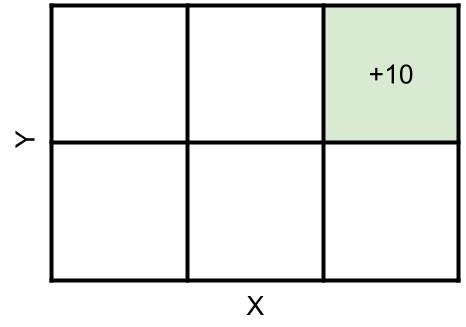

# RL Codebase Documentation
Run `python run.py` gives an example of code that implements a simple gridworld and solves for the optimal policy. 

The example MDP is a 3x2 gridworld where the (absorbing) reward state is at the upper right corner, as in the picture below. 

This document explains the code structure relevant to implementing this gridworld. You will use the same structures to implement your own (non-gridworld), discrete MDPs. 

### MDP variable structures
This is a codebase for solving discrete state and action space MDPs. The below explanations uses the gridworld as an example; however, note that these structures can be generalized for any discrete MDP: 
* **Total number of states** `S`
    * The total number of states in the example grid is `S = 2 x 3 = 6`
    * In our gridworld, the states will contain two elements, the x and y position. For example, to represent being at `x = 1` and `y = 0`, you might represent your state as a vector: `s = [x, y]` (see the image below)
    * Instead of representing the state as a vector, you can also represent it with a single index out of the `30` possible positions on the grid. For example, instead of using `s = [1, 0]`, we can use `i = 1`  (see the image below)
    * Note: the function `index_to_state` and `state_to_index` in `rl_utils.py` help switch from this state-based to index-based representation
* **Total number of actions** `A = 4`. 
    * In the gridworld, the actions are `[north, south, east, west]`, in this order. 
* **Transition matrix** `T`. This is a matrix of dimensionality `[S x A x S]`. 
    * Each of the state-action rows in a transition matrix must sum to one. In pythonic terms, this means that `T[s, a, :].sum() == 1` must be true for all `s = 0, ..., S - 1` and `a = 0, ..., A - 1`. 
* **Reward matrix** `R`. 
    * This is a matrix of dimensionality `[S x A x S]`, which means that reward is a function of state, action, and next state. 
    * Note: if you want your reward to be a function of just current state, the remaining dimensions should be constant. For example, to have the reward at state `s` be `2`, you can set the reward matrix to be `R[s, :, :] = 2`

